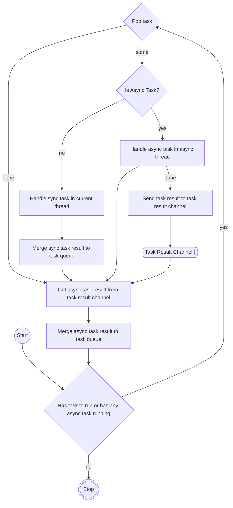
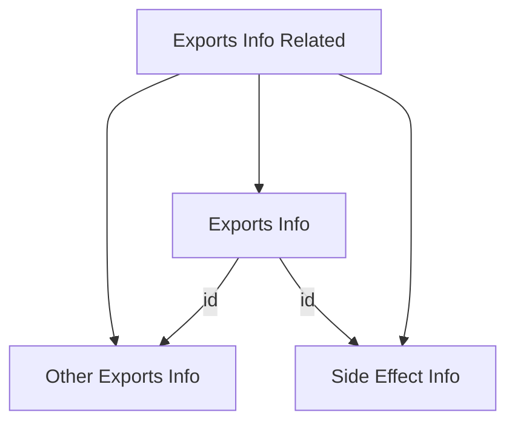
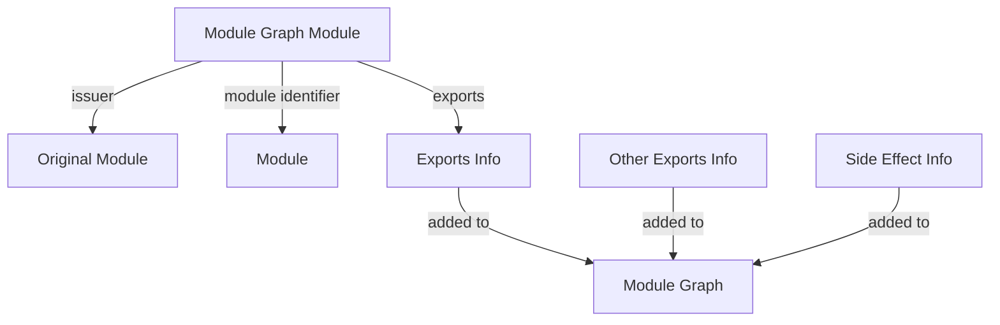

# Prepare testing environment

1. create a demo project `npx create-rspack --dir demo --template react`
1. follow https://rspack.dev/contribute/development/building to build the rspack CLI
1. use the rspack-cli binary built locally in our demo project (update the rspack path in the scripts)

```diff
"scripts": {
-   "dev": "cross-env NODE_ENV=development rspack serve",
-   "build": "cross-env NODE_ENV=production rspack build"
+   "dev": "cross-env NODE_ENV=development NO_COLOR=1 RSPACK_PROFILE=TRACE=layer=logger <YOUR_RSPACK_PATH>/packages/rspack-cli/bin/rspack.js serve",
+   "build": "cross-env NODE_ENV=production NO_COLOR=1 RSPACK_PROFILE=TRACE=layer=logger <YOUR_RSPACK_PATH>/packages/rspack-cli/bin/rspack.js build"
},
```

# How to debug

Rspack is using the [tracing](https://docs.rs/tracing/latest/tracing/) crate, so we can do this:

```rs
tracing::debug!("task: {:#?}", task);
```

Or we can use [instrument](https://docs.rs/tracing/latest/tracing/attr.instrument.html) to log a function:

```rs
use tracing::instrument;

#[instrument(name = "repair")]
pub async fn repair(
  compilation: &Compilation,
  mut artifact: MakeArtifact,
  build_dependencies: HashSet<BuildDependency>,
) -> Result<MakeArtifact> {}
```

# Workflow

1. `$ rspack build`
1. `Rspack::new`
   1. `Compiler::new`
      1. `PluginDriver::new`
      1. `Compilation::new`
1. `Rspack::build`
   1. `Compiler::build`
      1. `Compiler::compile`
         1. `self.compilation.make`
            1. `compiler::make::make_module_graph`
               1. prepare params
                  1. `MakeParam::BuildEntry`
                  1. `MakeParam::CheckNeedBuild`
                  1. `MakeParam::ModifiedFiles`
                  1. `MakeParam::RemovedFiles`
                  1. `MakeParam::ForceBuildModules`
                  1. `MakeParam::ForceBuildDeps`
               1. reset artifact
               1. `compiler::make::update_module_graph`
                  1. `Cutout::default`
                  1. get build dependencies from the artifact and params
                  1. `compiler::make::repair::repair`
                     1. get a new `ModuleGraph` from the artifact
                     1. create initial tasks (factorize::FactorizeTask)
                        1. the module factory of `EntryDependency` is `NormalModuleFactory`
                     1. create a `MakeTaskContext` from the compilation, artifact and compilation.cache
                     1. run the task loop with the `MakeTaskContext` and initial tasks
         1. `self.compilation.finish`
         1. `self.compilation.seal`
      1. `Compiler::compile_done`
         1. `self.emit_assets`

## Run Task Loop

```rs
pub async fn run_task_loop<Ctx: 'static>(
  ctx: &mut Ctx,
  init_tasks: Vec<Box<dyn Task<Ctx>>>,
) -> Result<()> {
  run_task_loop_with_event(ctx, init_tasks, |_, task| task).await
}
```

`run_task_loop` takes two arguments, and in our demo project:

1. `ctx` will be `MakeTaskContext` created by `MakeTaskContext::new(compilation, artifact, compilation.cache.clone())`
2. `init_tasks` will be `Vec<FactorizeTask>` for our entries

There are two types of tasks, each task could produce more tasks:

- Async Task: run in background (using `tokio::task::spawn`), so the task result need to be sent through a channel to be merged
- Sync Task: run in the main thread, so the task result can be merged directly.



## Tasks (rspack_core::compiler::make::repair)

| Task                      | Type  | Primary Purpose                                | Task Result                 |
| ------------------------- | ----- | ---------------------------------------------- | --------------------------- |
| `FactorizeTask`           | async | create a `Module` for this dependency          | [`FactorizeResultTask`]     |
| `FactorizeResultTask`     | sync  | create a `ModuleGraphModule` for this `Module` | [`AddTask`]                 |
| `AddTask`                 | sync  | TBD                                            | [] or [`BuildTask`]         |
| `BuildTask`               | async | TBD                                            | [`BuildResultTask`]         |
| `BuildResultTask`         | sync  | TBD                                            | [`ProcessDependenciesTask`] |
| `ProcessDependenciesTask` | sync  | TBD                                            | [`FactorizeTask`*]          |

### FactorizeTask

1. prepare `exports_info_related`
   1. create empty `other_exports_info`
   1. create empty `side_effects_only_info`
   1. create `exports_info` with `other_exports_info` and `side_effects_only_info`
1. create a module by the corresponding module factory
   - ex: create a `NormalModule` by `NormalModuleFactory::create` for `EntryDependency`
1. create a `FactorizeResultTask`



### FactorizeResultTask

Because it's a sync task, we can update the artifact through the context.

1. update dependencies (part of the artifact)
   - add file, context, and missing dependencies
1. update module graph (part of the artifact)
   1. create a new module `ModuleGraphModule` for the module graph with:
      - `module.identifier()`
      - `exports_info_related.exports_info.id()`
   1. set issuer with the original module identifier
   1. add `exports_info_related` to module graph
      - add `exports_info` to `exports_info`
      - add `side_effects_info` to `export_info`
      - add `other_exports_info` to `export_info`
1. create a `AddTask`



### AddTask

1. add `ModuleGraphModule` into module graph
1.

# Types

## ModuleType

```rs
#[cacheable]
#[derive(Debug, Clone, Copy, PartialEq, Eq, Hash)]
pub enum ModuleType {
  Json,
  Css,
  CssModule,
  CssAuto,
  JsAuto,
  JsDynamic,
  JsEsm,
  WasmSync,
  WasmAsync,
  AssetInline,
  AssetResource,
  AssetSource,
  Asset,
  Runtime,
  Remote,
  Fallback,
  ProvideShared,
  ConsumeShared,
  SelfReference,
  Custom(#[cacheable(with=AsPreset)] Ustr),
}
```

## PluginDriver

To align with webpack's functionality, Rspack has replicated most of webpack's built-in plugins. They maintain the same naming and configuration parameters as closely as possible and provide the same features.

Webpack plugins hooks:

- [Compiler Hooks](https://webpack.js.org/api/compiler-hooks/)
- [Compilation Hooks](https://webpack.js.org/api/compilation-hooks/)
- [ContextModuleFactory Hooks](https://webpack.js.org/api/contextmodulefactory-hooks/)
- [JavascriptParser Hooks](https://webpack.js.org/api/parser/)
- [NormalModuleFactory Hooks](https://webpack.js.org/api/normalmodulefactory-hooks/)

```rs
#[derive(Debug)]
pub struct PluginDriver {
  pub(crate) options: Arc<CompilerOptions>,
  pub plugins: Vec<Box<dyn Plugin>>,
  pub resolver_factory: Arc<ResolverFactory>,
  #[debug(skip)]
  pub registered_parser_and_generator_builder:
    FxDashMap<ModuleType, BoxedParserAndGeneratorBuilder>,
  /// Collecting error generated by plugin phase, e.g., `Syntax Error`
  pub diagnostics: Arc<Mutex<Vec<Diagnostic>>>,
  pub compiler_hooks: CompilerHooks,
  pub compilation_hooks: CompilationHooks,
  pub normal_module_factory_hooks: NormalModuleFactoryHooks,
  pub context_module_factory_hooks: ContextModuleFactoryHooks,
  pub normal_module_hooks: NormalModuleHooks,
  pub concatenated_module_hooks: ConcatenatedModuleHooks,
}
```

Rspack defines those hooks with [Procedural Macros](https://doc.rust-lang.org/reference/procedural-macros.html)

```rs
#[proc_macro]
pub fn define_hook(input: proc_macro::TokenStream) -> proc_macro::TokenStream {
  let input = syn::parse_macro_input!(input as hook::DefineHookInput);
  match input.expand() {
    syn::Result::Ok(tt) => tt,
    syn::Result::Err(err) => err.to_compile_error(),
  }
  .into()
}

define_hook!(CompilerThisCompilation: AsyncSeries(compilation: &mut Compilation, params: &mut CompilationParams));
define_hook!(CompilerCompilation: AsyncSeries(compilation: &mut Compilation, params: &mut CompilationParams));
define_hook!(CompilerMake: AsyncSeries(compilation: &mut Compilation));
define_hook!(CompilerFinishMake: AsyncSeries(compilation: &mut Compilation));
define_hook!(CompilerShouldEmit: AsyncSeriesBail(compilation: &mut Compilation) -> bool);
```

Those hooks will then be used like this throughout the rspack's codebase:

```rs
if let Some(e) = self // Compiler
  .plugin_driver
  .compiler_hooks
  .make
  .call(&mut self.compilation)
  .await
  .err()
{
  // collect errors if there is any
  self.compilation.push_diagnostic(e.into());
}
```

### Register ParserAndGenerator for each ModuleType

- `ModuleType::JsAuto` -> `JavaScriptParserAndGenerator`
- `ModuleType::JsEsm` -> `JavaScriptParserAndGenerator`
- `ModuleType::JsDynamic` -> `JavaScriptParserAndGenerator`
- `ModuleType::Css` -> `CssParserAndGenerator`
- `ModuleType::CssModule` -> `CssParserAndGenerator`
- `ModuleType::CssAuto` -> `CssParserAndGenerator`
- `ModuleType::Asset` -> `AssetParserAndGenerator`
- `ModuleType::AssetInline` -> `AssetParserAndGenerator`
- `ModuleType::AssetResource` -> `AssetParserAndGenerator`
- `ModuleType::AssetSource` -> `AssetParserAndGenerator`
- `ModuleType::Json` -> `JsonParserAndGenerator`
- `ModuleType::WasmAsync` -> `AsyncWasmParserAndGenerator`

Plugins register `ParserAndGenerator` for different `ModuleType`s in their apply method:

```rs
struct MyParserAndGenerator {}

impl Plugin for MyPlugin {
  fn name(&self) -> &'static str {
    "asset"
  }

  fn apply(
    &self,
    ctx: rspack_core::PluginContext<&mut rspack_core::ApplyContext>,
    _options: &CompilerOptions,
  ) -> Result<()> {
    ctx.context.register_parser_and_generator_builder(
      rspack_core::ModuleType::AssetInline,
      Box::new(move |parser_options: Option<&ParserOptions>, generator_options: Option<&GeneratorOptions>| {
        Box::new(MyParserAndGenerator {})
      }),
    );
  }
}

#[async_trait::async_trait]
pub trait Plugin: fmt::Debug + Send + Sync {
  fn name(&self) -> &'static str {
    "unknown"
  }

  fn apply(
    &self,
    _ctx: PluginContext<&mut ApplyContext>,
    _options: &CompilerOptions,
  ) -> Result<()> {
    Ok(())
  }

  fn clear_cache(&self) {}
}

impl ApplyContext<'_> {
  pub fn register_parser_and_generator_builder(
    &mut self,
    module_type: ModuleType,
    parser_and_generator_builder: BoxedParserAndGeneratorBuilder,
  ) {
    self
      .registered_parser_and_generator_builder
      .insert(module_type, parser_and_generator_builder);
  }
}
```

## MakeArtifact

```rs
#[derive(Debug, Default)]
pub struct MakeArtifact {
  // temporary data, used by subsequent steps of make
  // should be reset when rebuild
  pub diagnostics: Vec<Diagnostic>,
  pub has_module_graph_change: bool,
  pub built_modules: IdentifierSet,
  pub revoked_modules: IdentifierSet,
  // Field to mark whether artifact has been initialized.
  // Only Default::default() is false, `update_module_graph` will set this field to true
  // Persistent cache will update MakeArtifact when this is false.
  pub initialized: bool,

  // data
  pub make_failed_dependencies: HashSet<BuildDependency>,
  pub make_failed_module: IdentifierSet,
  pub module_graph_partial: ModuleGraphPartial,
  pub entry_dependencies: HashSet<DependencyId>,
  pub file_dependencies: FileCounter,
  pub context_dependencies: FileCounter,
  pub missing_dependencies: FileCounter,
  pub build_dependencies: FileCounter,
}
```

## Identifier

Rspack use [ustr](https://docs.rs/ustr/latest/ustr/index.html) as the inner type to get better performance.

```rs
#[cacheable(hashable)]
#[derive(Debug, Default, Clone, Copy, Eq, PartialEq, Ord, PartialOrd, Hash, Serialize)]
pub struct Identifier(#[cacheable(with=AsPreset)] Ustr);
```

On top of that, rspack use `Identifier` as the key for those collections:

```rs
pub type IdentifierMap<V> = HashMap<Identifier, V, BuildHasherDefault<IdentifierHasher>>;

pub type IdentifierSet = HashSet<Identifier, BuildHasherDefault<IdentifierHasher>>;
```

## ModuleGraphPartial

````rs
#[derive(Debug, Default)]
pub struct ModuleGraphPartial {
  /// Module indexed by `ModuleIdentifier`.
  pub(crate) modules: IdentifierMap<Option<BoxModule>>,

  /// Dependencies indexed by `DependencyId`.
  dependencies: HashMap<DependencyId, Option<BoxDependency>>,

  /// AsyncDependenciesBlocks indexed by `AsyncDependenciesBlockIdentifier`.
  blocks: HashMap<AsyncDependenciesBlockIdentifier, Option<Box<AsyncDependenciesBlock>>>,

  /// ModuleGraphModule indexed by `ModuleIdentifier`.
  module_graph_modules: IdentifierMap<Option<ModuleGraphModule>>,

  /// ModuleGraphConnection indexed by `DependencyId`.
  connections: HashMap<DependencyId, Option<ModuleGraphConnection>>,

  /// Dependency_id to parent module identifier and parent block
  ///
  /// # Example
  ///
  /// ```ignore
  /// let parent_module_id = parent_module.identifier();
  /// parent_module
  ///   .get_dependencies()
  ///   .iter()
  ///   .map(|dependency_id| {
  ///     let parents_info = module_graph_partial
  ///       .dependency_id_to_parents
  ///       .get(dependency_id)
  ///       .unwrap()
  ///       .unwrap();
  ///     assert_eq!(parents_info, parent_module_id);
  ///   })
  /// ```
  dependency_id_to_parents: HashMap<DependencyId, Option<DependencyParents>>,

  // Module's ExportsInfo is also a part of ModuleGraph
  exports_info_map: UkeyMap<ExportsInfo, ExportsInfoData>,
  export_info_map: UkeyMap<ExportInfo, ExportInfoData>,
  connection_to_condition: HashMap<DependencyId, DependencyCondition>,
  dep_meta_map: HashMap<DependencyId, DependencyExtraMeta>,
}
````

## ModuleGraph

```rs
#[derive(Debug, Default)]
pub struct ModuleGraph<'a> {
  partials: Vec<&'a ModuleGraphPartial>,
  active: Option<&'a mut ModuleGraphPartial>,
}
```

## ModuleProfile

`ModuleProfile` is used for profiling.

```rs
#[derive(Debug, Default, Clone)]
pub struct TimeRange {
  start: OnceCell<Instant>,
  end: OnceCell<Instant>,
}

#[derive(Debug, Default, Clone)]
pub struct ModulePhaseProfile {
  range: TimeRange,
  parallelism_factor: OnceCell<u16>,
}

#[derive(Debug, Default, Clone)]
pub struct ModuleProfile {
  pub factory: ModulePhaseProfile,
  pub building: ModulePhaseProfile,
}
```

## ModuleFactory

```rs
#[async_trait::async_trait]
pub trait ModuleFactory: Debug + Sync + Send {
  async fn create(&self, data: &mut ModuleFactoryCreateData) -> Result<ModuleFactoryResult>;
}
```

Each `Dependency` has its corresponding `ModuleFactory` which can be retrieved using `Compilation::get_dependency_factory`.

```rs
impl Compilation {
  pub fn get_dependency_factory(&self, dependency: &BoxDependency) -> Arc<dyn ModuleFactory> {}

  // ...
}
```

Note: some mappings between dependency by the corresponding module factory - ex: create a `NormalModule` by `NormalModuleFactory::create` for `EntryDependency1. create a `FactorizeResultTask`

### FactorizeResultTask

1. update artifact
   - because it's a sync task, we can update the artifact through the context

## ModuleFactoryCreateData

```rs
#[cacheable]
#[derive(Debug, Clone)]
pub struct ModuleFactoryCreateData {
  pub compilation_id: CompilationId,
  pub resolve_options: Option<Arc<Resolve>>,
  #[cacheable(with=As<FromContext>)]
  pub options: Arc<CompilerOptions>,
  pub context: Context,
  pub dependencies: Vec<BoxDependency>,
  pub issuer: Option<Box<str>>,
  pub issuer_identifier: Option<ModuleIdentifier>,
  pub issuer_layer: Option<ModuleLayer>,
  pub resolver_factory: Arc<ResolverFactory>,

  pub file_dependencies: HashSet<ArcPath>,
  pub context_dependencies: HashSet<ArcPath>,
  pub missing_dependencies: HashSet<ArcPath>,
  #[cacheable(with=Skip)]
  pub diagnostics: Vec<Diagnostic>,
}
```

### 1. `file_dependencies`

- Definition: A list of specific files that a module or build depends on.
- Purpose:
  - Tracks files that must be read or watched for changes during the build process.
  - Includes direct imports or requires, such as `import './file.js'`.
- Typical Use Case:
  - Resolving a dependency like `import './file.js'` adds `./file.js` to `file_dependencies`.
  - If the file changes, it triggers a rebuild of affected parts of the project.
- Examples:
  - Dependencies from JavaScript imports: `import x from './utils.js'`.
  - Direct file references in CSS: `@import 'styles.css';`.
- Role in Watch Mode:
  - Changes to these files cause a recompile.

### 2. `context_dependencies`

- Definition: A list of directories or contexts that a module or build depends on.
- Purpose:
  - Tracks dynamic or context-based dependencies where multiple files in a directory might match.
  - Includes patterns like `require.context()` or dynamic imports with variable paths.
- Typical Use Case:
  - When using `require.context('./dir', true, /\.js$/)`, the entire `./dir` directory is added to `context_dependencies`.
  - Any changes to files in `./dir` trigger a rebuild, even if the files weren’t explicitly listed as `file_dependencies`.
- Examples:
  - Dynamic imports: `import('./modules/' + name)` (depends on `./modules/` directory).
  - Glob patterns in loaders: Loading all `.js` files in a folder.
- Role in Watch Mode:
  - Monitors all files in the specified directories and rebuilds if any of them change.

### 3. `missing_dependencies`

- Definition: A list of files or directories that were expected but not found during the build process.
- Purpose:
  - Tracks unresolved dependencies that might cause errors or require special handling.
  - Helps identify missing files or incorrect paths during development.
- Typical Use Case:
  - If you try `import './missingFile.js'` but the file doesn't exist, `./missingFile.js` is added to `missing_dependencies`.
  - Ensures rebuilds are triggered if the missing file is later created.
- Examples:
  - Non-existent imports: `import './not-there.js'`.
  - Missing directories or files in a dynamic import context.
- Role in Watch Mode:
  - Watches for the creation of missing files and triggers a rebuild when they appear.

### Comparison Table

| Field              | `file_dependencies`                      | `context_dependencies`                          | `missing_dependencies`                              |
| ------------------ | ---------------------------------------- | ----------------------------------------------- | --------------------------------------------------- |
| Definition         | List of specific files required          | List of directories or contexts                 | List of files/directories that are missing          |
| Scope              | Single files                             | Entire directories or patterns                  | Non-existent files or directories                   |
| Typical Use Case   | Direct imports like `import './file.js'` | Dynamic imports like `require.context('./dir')` | Unresolved imports like `import './missingFile.js'` |
| Role in Watch Mode | Rebuild on file changes                  | Rebuild on any file change in the context       | Rebuild when the missing file appears               |
| Examples           | `./file.js`, `./style.css`               | `./dir/`, `./components/`                       | `./missingFile.js` or missing directory             |

## Dependency

```rs
pub trait Dependency:
  AsDependencyTemplate
  + AsContextDependency
  + AsModuleDependency
  + AsAny
  + DynClone
  + Send
  + Sync
  + Debug
{}
```

In Rspack, `DependencyTemplate`, `ModuleDependency`, and `ContextDependency` are components used to represent and manage dependencies within the module system. While they are related, they serve distinct purposes in the dependency resolution and bundling process.

### 1. DependencyTemplate

- Purpose: Manages the code generation for a dependency.
- Responsibilities:
  - Defines how the resolved dependency should be transformed into code during the build process.
  - Responsible for creating the runtime code that connects modules, such as `require`, `import`, or `__webpack_require__` calls.
- Role:
  - Works at the code generation stage of the build process.
  - Converts dependency data into executable output (JavaScript code).
- Example:
  - If you have `import x from './file.js'`, the `DependencyTemplate` generates the code that requires the module (`__webpack_require__('./file.js')`).

### 2. ModuleDependency

- Purpose: Represents a specific module-level dependency in the dependency graph.
- Responsibilities:
  - Contains information about a single dependency, such as:
    - The module it depends on.
    - The type of dependency (e.g., `ESM`, `CJS`, `AMD`).
  - Acts as a concrete link between a module and its resolved dependencies.
- Role:
  - Provides metadata and resolves a module path (e.g., `import './file.js'` resolves to an actual file).
  - Part of the module resolution stage.
- Example:
  - `ModuleDependency` represents the dependency created by `import x from './file.js'` in the source file.
  - It tracks the resolved path (`./file.js`) and stores related information.

### 3. ContextDependency

- Purpose: Represents dynamic dependencies or dependencies within a context.
- Responsibilities:
  - Handles cases where dependencies are determined dynamically at runtime, such as:
    - `require.context()` in Webpack/Rspack.
    - Glob imports or dynamic imports that resolve multiple files (e.g., `import('./modules/' + name)`).
  - Resolves a set of modules that match a specific pattern or criteria.
- Role:
  - Part of the context resolution stage, dealing with broader or dynamic module requirements.
- Example:
  - If you use `require.context('./modules', true, /\.js$/)`, `ContextDependency` resolves all `.js` files in the `./modules` directory and registers them as dependencies.

### Key Differences

| Trait            | DependencyTemplate                     | ModuleDependency                      | ContextDependency                            |
| ---------------- | -------------------------------------- | ------------------------------------- | -------------------------------------------- |
| Purpose          | Code generation for dependencies       | Represents a single module dependency | Handles dynamic dependencies or contexts     |
| Stage in Process | Code generation (build output)         | Module resolution                     | Context resolution                           |
| Scope            | Defines runtime code for a dependency  | Tracks a specific module relationship | Tracks a set of dynamically resolved modules |
| Example Use Case | Generating `__webpack_require__` calls | Resolving `import './file.js'`        | Resolving `require.context('./dir')`         |
| Dynamic Handling | No                                     | No                                    | Yes                                          |

### Example

In the demo project, our first dependency is a `EntryDependency`

```rs
EntryDependency {
    id: DependencyId(
        0,
    ),
    request: "./src/main.jsx",
    context: Context {
        inner: "/Users/linweitang/boar-hat/gowther/how-rspack-works/demo",
    },
    layer: None,
    is_global: false,
},
```
