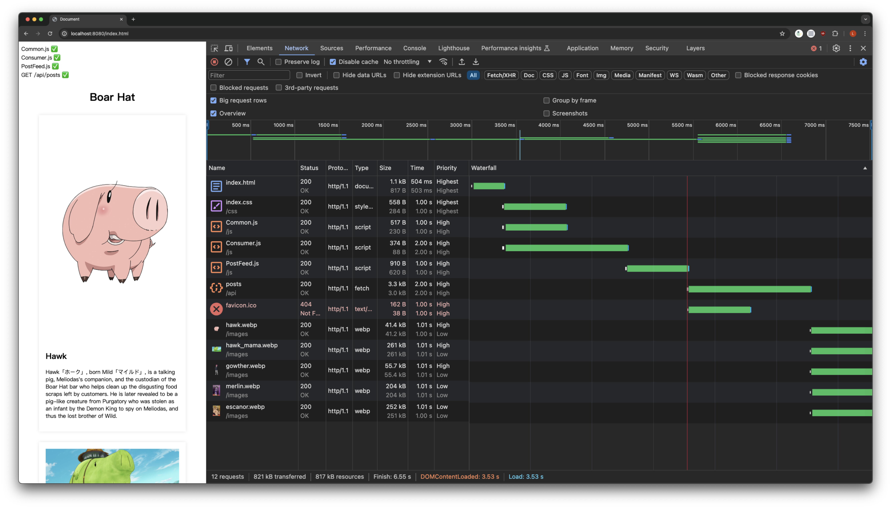
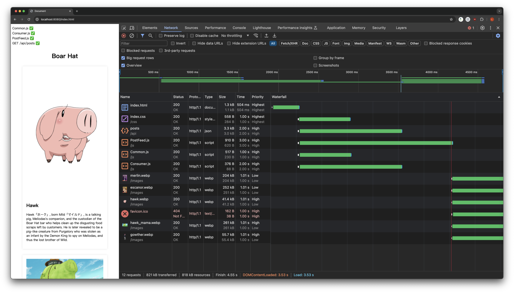

Those latency are added intensionally, see the `backend/src/main.rs`.

| resource       | latency | description                      |
| -------------- | ------- | -------------------------------- |
| index.html     | 0.5s    |                                  |
| css/index.css  | 1s      |                                  |
| js/Common.js   | 1s      | render the header & footer       |
| js/Consumer.js | 2s      | import js/PostFeed.js            |
| js/PostFeed.js | 3s      | fetch posts then render the feed |
| GET /api/posts | 2s      |                                  |
| each image     | 1s      |                                  |

# v0

Time for users to see boar hat feed: 8.5s

```
8.5s =
    index.html(0.5s)
    + js/Consumer.js(2s)
    + js/PostFeed.js(3s)
    + GET /api/posts(2s)
    + images(1s)
```



# v1 - Preload

Time for users to see boar hat feed: 4.5s

```
4.5s =
    index.html(0.5s)
    + Max(
        js/Consumer.js(2s),
        js/PostFeed.js(3s),
        GET /api/posts(2s)
    )
    + images(1s)
```


