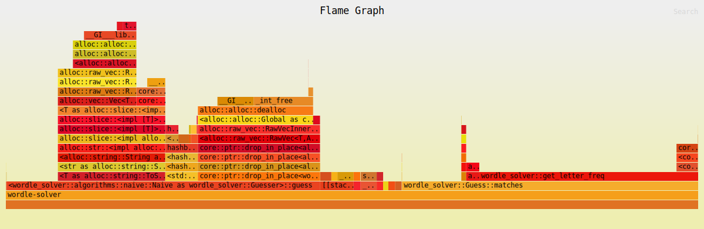
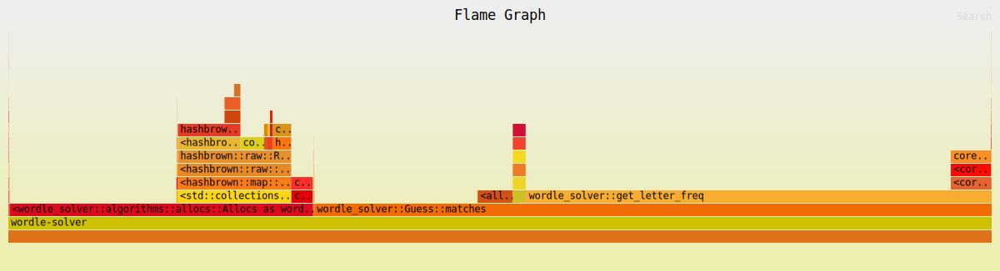
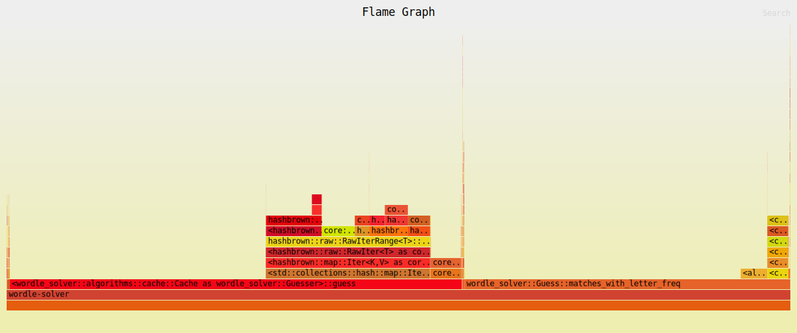
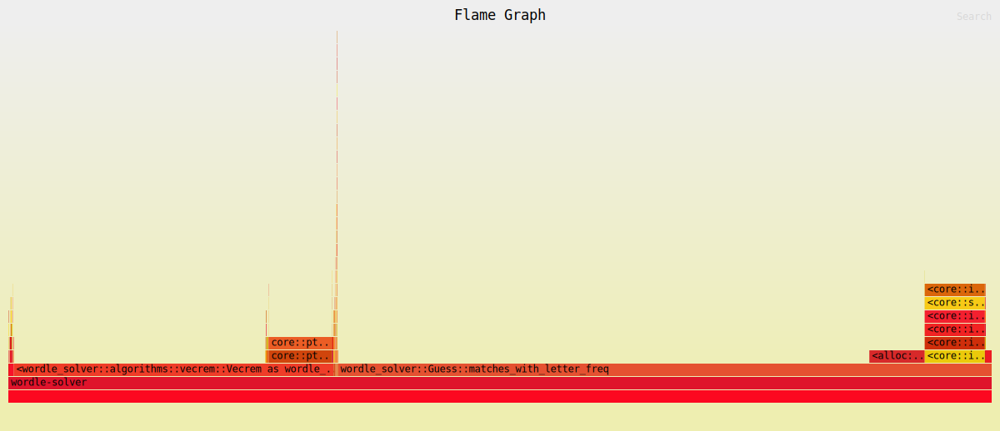

# Profiling

- For flame graph: https://github.com/jonhoo/inferno
- For benchmark: https://github.com/sharkdp/hyperfine

## Naive

```shell
$ perf record --call-graph dwarf target/release/wordle-solver -i naive -m 10
$ perf script | inferno-collapse-perf | inferno-flamegraph > perf_naive.svg
```



## Allocs

```shell
$ hyperfine \
  -n naive "target/release/wordle-solver -i naive -m 10" \
  -n allocs "target/release/wordle-solver -i allocs -m 10"

# allocs ran 1.96 ± 0.04 times faster than naive
```

```shell
$ perf record --call-graph dwarf target/release/wordle-solver -i allocs -m 10
$ perf script | inferno-collapse-perf | inferno-flamegraph > perf_allocs.svg
```



## Cache

```shell
hyperfine \
  -n allocs "target/release/wordle-solver -i allocs -m 10" \
  -n cache "target/release/wordle-solver -i cache -m 10"

# cache ran 1.61 ± 0.30 times faster than allocs
```

```shell
$ perf record --call-graph dwarf target/release/wordle-solver -i cache -m 10
$ perf script | inferno-collapse-perf | inferno-flamegraph > perf_cache.svg
```



## Vecrem

```shell
hyperfine \
  -n cache "target/release/wordle-solver -i cache -m 10" \
  -n vecrem "target/release/wordle-solver -i vecrem -m 10"

# vecrem ran 1.93 ± 0.06 times faster than cache
```

```shell
$ perf record --call-graph dwarf target/release/wordle-solver -i vecrem -m 10
$ perf script | inferno-collapse-perf | inferno-flamegraph > perf_vecrem.svg
```



## Weight

Improve the average score to 3.94 from 4.19.

## Prune

```shell
hyperfine \
  -n weight "target/release/wordle-solver -i weight -m 10" \
  -n prune "target/release/wordle-solver -i prune -m 10"

# prune ran 38.25 ± 0.56 times faster than weight
```

# Reference

- [Implementing and Optimizing a Wordle Solver in Rust](https://youtu.be/doFowk4xj7Q)
- [jonhoo/roget](https://github.com/jonhoo/roget)
