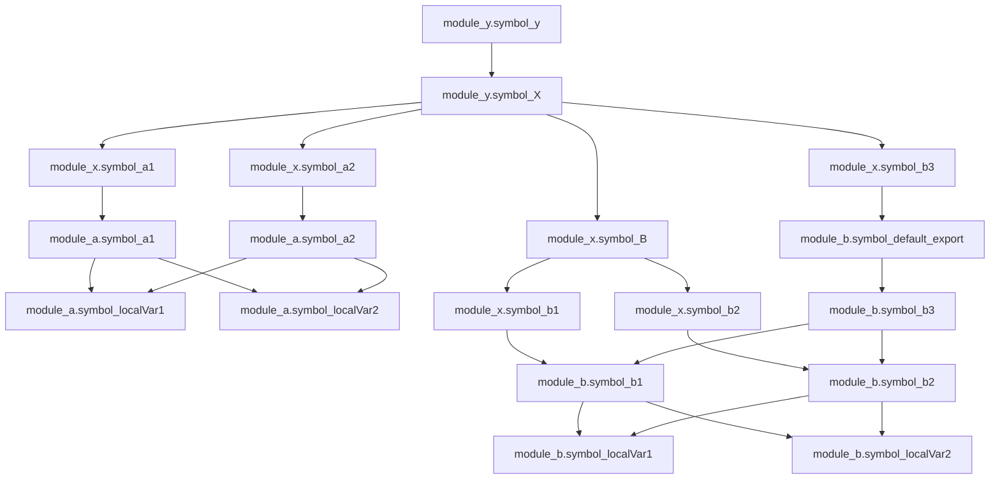
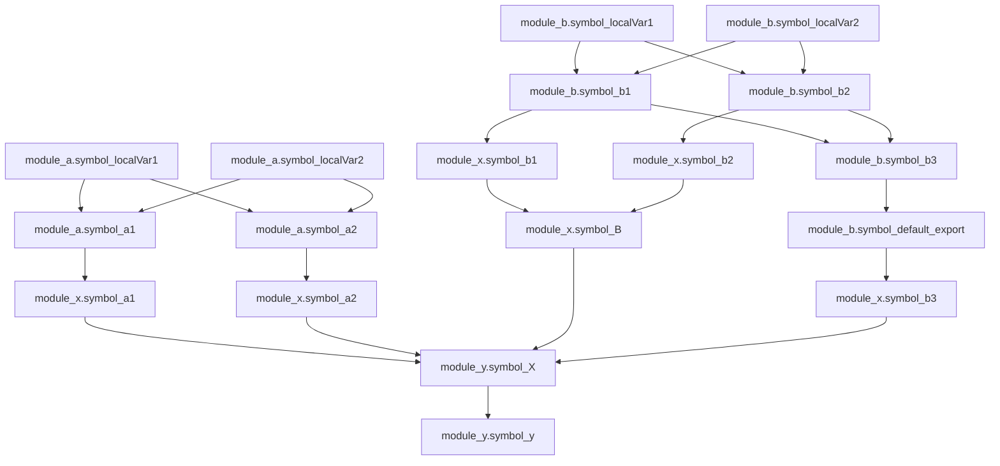

# Dependency Tracker

If you only need to track the dependency between modules, [dependency-cruiser](https://github.com/sverweij/dependency-cruiser) is probably what you need. Instead, I hope you find this project useful if you're looking for a more fine-grained dependency tracker.

This tool is currently used internally inside my own projects. So maybe some of the assumptions don't meet yours. Current assumptions are as follows:

1. Every import is valid.
2. No circular dependency.

# Overview

## Basic

`B`, `C`, `D`, `E`, `F`, `G`, `H`, `I` all depend on `A`.

```js
const A = "Hello";

const B = A;
const C = [A];
const D = { A };
const E = () => A;
function F() {
  return A;
}
class G {
  someMethod = () => {
    return A;
  };
}
const H = new Set([A]);
const I = new Map(["A", A]);
```

## Mutating after creation will be ignored

Those cases are ignored intensionally. Since we are only tracing the dependency of identifiers at the top level (module scope), and mutating those top level identifiers are not common.

`B`, `C`, `D`, `E`, `F`, `G`, `H`, `I` all depend on nothing.

```js
const A = "Hello";

let B = "";
B = A;

const C = [];
C.push(A);

const D = {};
D.A = A;

const E = () => "";
E.A = A;

function F() {
  return "";
}
F.A = A;

class G {
  someMethod = () => {
    return A;
  };
}
G.A = A;

const H = new Set();
H.insert(A);

const I = new Map();
I.set("A", A);
```

We do mutate the top level identifiers sometimes as follows, but let's skip them for now.

```js
const Card = () => {};
const CardTitle = () => {};
Card.title = CardTitle;
```

```js
const Card = () => {};
Card.propTypes = {};
Card.defaultProps = {};
```

## Property accessors are ignored

`E` depends on `C` and `D` but not `A` and `B`.

```js
const A = "A";
const B = "B";
const C = [A, B];
const D = { A, B };

const E = [C[0], C[1], D.A, D.B];
```

Another case is namespace import, here Waddle Dee depends on Kirby entirely, not depends directly on Kirby's Weapon and Power.

```js
import * as Kirby from "kirby";

const WaddleDee = [Kirby.Weapon, Kirby.Power];
```

## Re-exporting will copied all symbols of named exports form the source module

```js
// kirby.js
export { Weapon, Power, Kirby as default };

// waddle-dee.js
export * from "kirby"; // make a local symbol of Weapon and Power
```

## Export-all as identifier will only create one local symbol

```js
// kirby.js
export { Weapon, Power, Kirby as default };

// waddle-dee.js
export * as Kirby from "kirby"; // only create one local symbol Kirby
```

# Illustration

Let's say we have four files.

```js
// a.js
const localVar1 = {};
const localVar2 = {};

export const a1 = { localVar1, localVar2 };
export const a2 = { localVar1, localVar2 };

export default function a3() {
  return { a1, a2 };
}
```

```js
// b.js
const localVar1 = {};
const localVar2 = {};

export const b1 = { localVar1, localVar2 };
export const b2 = { localVar1, localVar2 };

export default function b3() {
  return { b1, b2 };
}
```

```js
// x.js
export * from "./a";
export * as B from "./b";
export { default as b3 } from "./b";
```

```js
// y.js
import * as X from './x';

const y = { X.a1, X.B.b1, X.b3 };
```

## Step1: Determine the parsing order by scheduler

[`a.js`, `b.js`, `y.js`] -> [`x.js`]

`x.js` is blocked due to `export * from './a'` and `export * as B from './b'` because the re-exporting all need to be expanded.

## Step2: Parse modules in parallel by spawning threads

`a.js`, `b.js` and `y.js` will be parsed in parallel.

### Step2.1: Get the symbols we want to track their dependency

| `a.js` |  symbol name   | is exported | import from / import type | depend on |
| ------ | :------------: | :---------: | :-----------------------: | :-------: |
|        |   localVar1    |    False    |            --             |    N/A    |
|        |   localVar2    |    False    |            --             |    N/A    |
|        |       a1       |    True     |            --             |    N/A    |
|        |       a2       |    True     |            --             |    N/A    |
|        |       a3       |    False    |            --             |    N/A    |
|        | DEFAULT_EXPORT |    False    |            --             |    a3     |

| `b.js` |  symbol name   | is exported | import from / import type | depend on |
| ------ | :------------: | :---------: | :-----------------------: | :-------: |
|        |   localVar1    |    False    |            --             |    N/A    |
|        |   localVar2    |    False    |            --             |    N/A    |
|        |       b1       |    True     |            --             |    N/A    |
|        |       b2       |    True     |            --             |    N/A    |
|        |       b3       |    False    |            --             |    N/A    |
|        | DEFAULT_EXPORT |    False    |            --             |    b3     |

| `y.js` | symbol name | is exported | import from / import type | depend on |
| ------ | :---------: | :---------: | :-----------------------: | :-------: |
|        |      X      |    False    |   `./x.js` / Namespace    |    N/A    |
|        |      y      |    False    |            --             |    N/A    |

### Step2.2: Trace symbols' dependency

| `a.js` |  symbol name   | is exported | import from / import type |      depend on       |
| ------ | :------------: | :---------: | :-----------------------: | :------------------: |
|        |   localVar1    |    False    |            --             |         N/A          |
|        |   localVar2    |    False    |            --             |         N/A          |
|        |       a1       |    True     |            --             | localVar1, localVar2 |
|        |       a2       |    True     |            --             | localVar1, localVar2 |
|        |       a3       |    False    |            --             |        a1, a2        |
|        | DEFAULT_EXPORT |    False    |            --             |          a3          |

| `b.js` |  symbol name   | is exported | import from / import type |      depend on       |
| ------ | :------------: | :---------: | :-----------------------: | :------------------: |
|        |   localVar1    |    False    |            --             |         N/A          |
|        |   localVar2    |    False    |            --             |         N/A          |
|        |       b1       |    True     |            --             | localVar1, localVar2 |
|        |       b2       |    True     |            --             | localVar1, localVar2 |
|        |       b3       |    False    |            --             |        b1, b2        |
|        | DEFAULT_EXPORT |    False    |            --             |          b3          |

| `y.js` | symbol name | is exported | import from / import type | depend on |
| ------ | :---------: | :---------: | :-----------------------: | :-------: |
|        |      X      |    False    |   `./x.js` / Namespace    |    N/A    |
|        |      y      |    False    |            --             |     X     |

### Step2.3: Send parsed module back to main thread

Main thread receives `Module a`, `Module b` and `Module y`.

### Step2.4: Expand the re-exporting all statement and resolve the import from path

| `y.js` | symbol name | is exported | import from / import type | depend on |
| ------ | :---------: | :---------: | :-----------------------: | :-------: |
|        |      X      |    False    | `<root>/x.js` / Namespace |    N/A    |
|        |      y      |    False    |            --             |     X     |

### Step2.5: Release the blocking edge in scheduler

Scheduler marks `x.js` as parsing candidate. So we need to parse `x.js` through Step2.1 to Step2.5 again.

### Step2.1: Get the symbols we want to track their dependency

```js
// x.js
export * from "./a";
export * as B from "./b";
export { default as b3 } from "./b";
```

| `x.js` |         symbol name          | is exported |  import from / import type  | depend on |
| ------ | :--------------------------: | :---------: | :-------------------------: | :-------: |
|        | TODO: give it a random name? |    True     | `./a.js` / Re-exporting all |    N/A    |
|        |              B               |    True     | `./b.js` / Re-exporting all |    N/A    |
|        |              b3              |    True     |     `./b.js` / Default      |    N/A    |

### Step2.2: Trace symbols' dependency

Nothing changed for `Module x`.

### Step2.3: Send parsed module back to main thread

Main thread receives `Module x`.

### Step2.4: Expand the re-exporting all statement and resolve the import from path

| `x.js` | symbol name | is exported | import from / import type | depend on |
| ------ | :---------: | :---------: | :-----------------------: | :-------: |
|        |     a1      |    True     |   `<root>/a.js` / Named   |    N/A    |
|        |     a2      |    True     |   `<root>/a.js` / Named   |    N/A    |
|        |     b1      |    False    |   `<root>/b.js` / Named   |    N/A    |
|        |     b2      |    False    |   `<root>/b.js` / Named   |    N/A    |
|        |      B      |    True     |            --             |  b1, b2   |
|        |     b3      |    True     |  `<root>/b.js` / Default  |    N/A    |

### Step2.5: Release the blocking edge in scheduler

No modules left to be parsed. Go to Step3.

## Step3: Reverse the dependency

Current dependency:



Reversed dependency:



## Step4: Cache the dependency

Output the graph with [serde-rs](https://serde.rs/).

## Step5: Lookup symbol's used-by graph

We can now find all the paths depends on the `module_a.symbol_localVar1` by traversing our graph. 🥳

# Symbol

Symbol is the basic unit used internally in `DependencyTracker`. We can get the
information about "Is it exported?", "Does it depends on other symbols in the
same module?", "Is it imported from other module?".

## Examples

### Default Import

```js
import A from "module-a";
```

In symbol representation:

```rs
Symbol {
  name: "A",
  is_named_exported: false,
  import_from: Some(
    Import {
      from: "module-a",
      import_type: ImportType::DefaultImport
  }),
  depend_on: None
}
```

### Named Import

```js
import { A as B } from "module-a";
```

In symbol representation:

```rs
Symbol {
  name: "B",
  is_named_exported: false,
  import_from: Some(
    Import {
      from: "module-a",
      import_type: ImportType::NamedImport("A")
  }),
  depend_on: None
}
```

### Namespace Import

```js
import * as A from "module-a";
```

In symbol representation:

```rs
Symbol {
  name: "A",
  is_named_exported: false,
  import_from: Some(
    Import {
      from: "module-a",
      import_type: ImportType::NamespaceImport("A")
  }),
  depend_on: None
}
```

### Named Export

```js
export A;
```

In symbol representation:

```rs
Symbol {
  name: "A",
  is_named_exported: true,
  import_from: None,
  depend_on: None
}
```

### Default Export

```js
export default A;
```

In symbol representation:

```rs
Symbol {
  name: "____DEFAULT__EXPORT____",
  is_named_exported: false,
  import_from: None,
  depend_on: None
}
```

### Rename Export

```js
export { A as B };
```

In symbol representation:

```rs
Symbol {
  name: "B",
  is_named_exported: true,
  import_from: None,
  depend_on: Some(HashSet(["A"]))
}
```

### Re-exporting

```js
export { A as B } from "module-a";
```

In symbol representation:

```rs
Symbol {
  name: "B",
  is_named_exported: true,
  import_from: Some(
    Import {
      from: "module-a",
      import_type: ImportType::NamedImport("A")
  }),
  depend_on: None
}
```

### Re-exporting Default

```js
export { Default as A } from "module-a";
```

In symbol representation:

```rs
Symbol {
  name: "A",
  is_named_exported: true,
  import_from: Some(
    Import {
      from: "module-a",
      import_type: ImportType::DefaultExport
  }),
  depend_on: None
}
```

# Parsing Order

The parsing order for JavaScript modules `module-a` and `module-b` below
will be determined by the `Scheduler`. `Scheduler` will parse the `module-b`
first then `module-a` because `module-a` imports the namespace of `module-b`.

```js
// module-b.js
export Header;
export Body;
export Footer;

// module-a.js
import * as UI from "module-b";
const A = UI;
```

# Expansion of the Namespace Import

The goal of "expansion" is to replace the all the namespace imports with named exports.

Let's continue with the "module-a" and "module-b" example in the parsing order section.

"module-b" will be parsed into the symbol representation like this:

```rs
Symbol { name: "Header", is_named_exported: true, import_from: None, depend_on: None }
Symbol { name: "Body", is_named_exported: true, import_from: None, depend_on: None }
Symbol { name: "Footer", is_named_exported: true, import_from: None, depend_on: None }
```

And "module-a" will be parsed into the symbol representation like this:

```rs
Symbol {
  name: "A",
  is_named_exported: false,
  import_from: None,
  depend_on: Some(HashSet(["UI"]))
}

Symbol {
  name: "UI",
  is_named_exported: false,
  import_from: Some(
    Import {
      from: "module-name"
      import_type: ImportType::NamespaceImport(vec!["A"])
  }),
  depend_on: None
}
```

After the expansion of "module-a", the new symbol representation becomes:

```rs
Symbol {
  name: "A",
  is_named_exported: false,
  import_from: None,
  depend_on: Some(HashSet(["Header", "Body", "Footer"]))
}

Symbol {
  name: "Header",
  is_named_exported: false,
  import_from: Some(
    Import {
      from: "module-name"
      import_type: ImportType::NamedImport("Header")
  }),
  depend_on: None
}

Symbol {
  name: "Body",
  is_named_exported: false,
  import_from: Some(
    Import {
      from: "module-name"
      import_type: ImportType::NamedImport("Body")
  }),
  depend_on: None
}

Symbol {
  name: "Footer",
  is_named_exported: false,
  import_from: Some(
    Import {
      from: "module-name"
      import_type: ImportType::NamedImport("Footer")
  }),
  depend_on: None
}
```

You should notice that the `Symbol UI` in "module-a" is removed. Instead, all the
named exported symbols `Symbol Header`, `Symbol Body` and `Symbol Footer` are added
into "module-a". Another important thing is `Symbol A`'s dependency is also updated.
