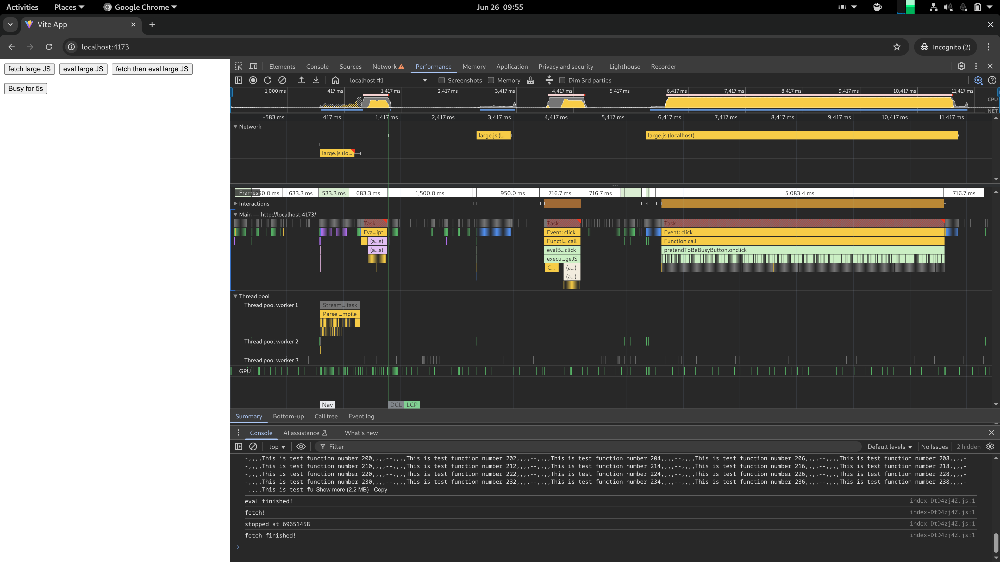

# JS download time

## Setup

1. generate the large js file: `node ./gen.js`
2. install dependencies: `pnpm install`
3. build: `pnpm build`
4. run the server without gzip: `node ./preview-server.js`

## Findings

### `fetch('/large.js')` is blocked by long tasks on the main thread

When using `fetch()` to download a large JavaScript file, the download time can be delayed if the main thread is occupied by long tasks. This suggests that even network operations like fetch can be affected by main thread availability.

### The browser automatically parses and compiles JavaScript using background threads when loaded via `script src="/large.js"`, but not when using `fetch('/large.js)`

When a script is loaded using a `<script>` tag, the browser streams, parses, and compiles the code off the main thread using a dedicated thread pool (e.g., V8’s compiler threads). This allows for efficient execution preparation. In contrast, `fetch('/large.js')` only retrieves the file as raw text or bytes, it is not parsed or compiled unless explicitly evaluated, and even then, the parsing typically happens on the main thread (e.g., via `eval()`), which can block execution.
